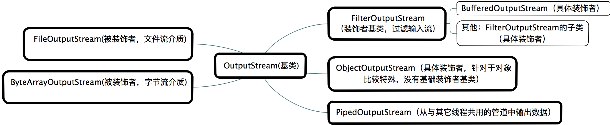
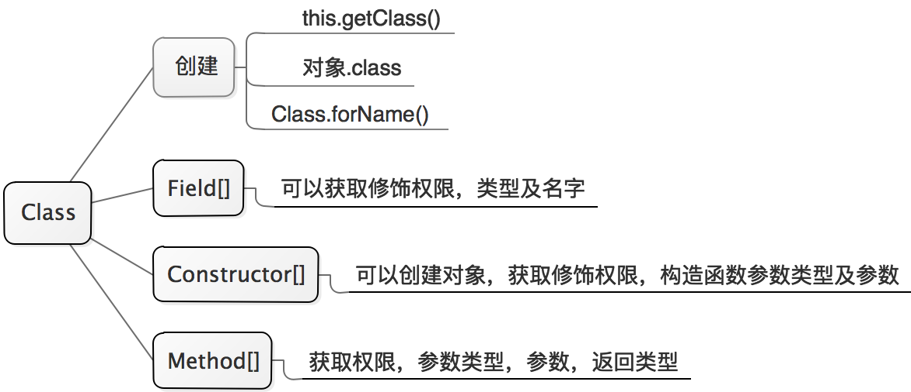

## 基础

## base（java.lang）

​	java的base包，唯一一个只使用不用导包的包。
​	主要类的类型有：基本类型的包装类型，异常类，进程类，Thread的相关类，字符（串）的系列类。

- Object：主要提供hashcode，equals ，getClass，以及线程之间通信的方式：等待和唤醒。
- System
  - 主要是native方法
  - 集成一些其他类像IO流，
  - 集成RunTime的方法
  - nanoTime（）：获取微妙值，主要用于线程阻塞时间的计算。
  - arraycopy（）：高效数组的拷贝，(包括Arrays.copyOf) 都是拷贝引用
- RunTime：exit，gc，exec，获取os运行核数。
- Class：对象字节码对象，反射的重点

## collection(java.util)

​	**这个包主要以集合为主，这是数据结构的最佳实践。**

### 集合清单

| 接口 |   实现    |     链表      | 线程安全  | 支持排序 | 队列  |
| :--: | :-------: | :-----------: | :-------: | :------: | :---: |
| Map  |  HashMap  | LinkedHashMap | HashTable | TreeMap  | **~** |
| Set  |  HashSet  | LinkedHashSet |   **~**   | TreeSet  | **~** |
| List | ArrayList |  LinkedList   |  Vector   |  **~**   | Stack |

### Map

- 这是集合中个人认为是最关键最复杂的类，搞清楚map的常用实现类是非常关键的对于认识集合总体的实现。
- 每个key，value键值对封装为Map.Entry<K, V> 实体bean。

#### HashMap

- 数据结构：Node实体数组（又叫Hash表或散列表，hash函数又叫散列函数）+ 单向链表+红黑树（又叫自平衡二叉查找树）。

- Node实体基本结构：hash,key,value,next(链表的下一个实体);Map.Entry<K, V> 实现类。

- TreeNode实体基本结构：parent,left,right,prev;TreeNode继承LinkedHashMap.Entry继承HashMap.Node<K,V>。

- 数组上的元素为链表（或红黑树）的头节点（或根节点）。

- 对于hash冲突解决办法使用链表（或红黑树），当链表长度大于等于8时转化为红黑树。之所以转化为红黑树是当数量大时红黑树的查询效率更高。

- 操作红黑树，增加删除后为了自平衡 进行的左右旋和重新着色。

  **时间复杂度**

| 结构   | 查询时间复杂度 | 说明           |
| ------ | -------------- | -------------- |
| hash表 | O（1）         |                |
| 链表   | O（n）         | 遍历链表去查找 |
| 红黑树 | O（log n）     |                |

​	**多线程下当共享变量使用时，扩容链表造成的问题**

| 版本     | 元素是否倒置                                                 | 元素是否丢失 | 复杂程度       |
| -------- | ------------------------------------------------------------ | ------------ | -------------- |
| 1.7      | 倒置(易形成闭合回路)                                         | 没验证       | 代码量约1000行 |
| 1.8      | 不倒置(99%的认为不会形成，1%再验证)                          | 会丢失       | 代码量约2000行 |
| 解决办法 | 不当共享变量使用（在局部变量中 new创建 是没问题的，在栈中操作，属于私有的）或使用Collections.synchronizedMap(Map<K, V>)或ConcurrentHashMap |              |                |

#### HashTable

- 数据结构：数组+单向链表。
- Entry实体基本结构：hash,key,value,next与HsahMap的Node实体结构一致;Map.Entry<K, V> 实现类。
- 扩容时元素顺序不变。
- 由于HashTable是同步的，多数方法添加了synchronized关键字同步。

#### TreeMap

- 数据结构：红黑树（天然排序）。
- Entry结构：key，value， left，right，parent，color
- 由于这是排序的hash表，必须在构造函数传递比较器Comparator实现类或添加的实体实现Comparable接口
  - Comparator和Comparable区别：Comparable，方便，实体直接继承，不灵活。Comparator，灵活，根据业务多维度实现比较
- 实现结果基本和HashMap的红黑树实现部分一致

#### LinkedHashMap

- 数据结构：双向链表（**输入的顺序和添加顺序一致**）

- Entry结构，继承自HashMap.Node ,新添加before, after属性

- 继承自HashMap

- 新添加的元素放置到链表的尾部，遍历时从头节点开始，保证了输入的顺序和添加顺序一致

  几种map总结：
      1、在存储上基本与value没有关系，主要依赖K和K的hash值来放置到合适位置。
      2、内部实现上基本以循环操作为主。

### Set

#### HashSet

- 实现依赖于HashMap

#### LinkedHashSet

- 实现依赖于LinkedHashMap（通过构造函数调用HashSet的LinkedHashMap构造函数实现）

#### TreeSet

- 支持排序，实现SortedSet接口
- 实现依赖于NavigableMap

### List

#### ArrayList

- 数据结构：数组
- 扩容依赖Arrays.copyOf()，它又依赖于 System.arraycopy（）
- 通过索引访问遍历效率最高，而使用迭代器的效率最低（还可以通过增强for循环遍历）

#### LinkedList

- 数据结构：双向链表
- Node实体：item,next, prev(当前，下一个，上一个)
- LinkedList可以作为FIFO(先进先出)的队列
- LinkedList可以作为LIFO(后进先出)的栈

#### Vector

- 数据结构：数组
- 支持同步

#### Stack

- 数据结构：数组
- 继承自Vector，支持同步，先进后出

### 工具类

- Arrays：提供一系列静态方法，对数组排序，搜索等
- Collections ：提供一系列静态方法，对集合 排序，搜索，包装集合为安全类型等。包装基本实现思路为，传入之后赋值给局部变量，通过synchronized关键字同步对于传入集合的原有方法加以限制。

## io（java.io）
​	理解类提供的功能,才能更准确的使用。要理解io必须先了解一些基本的概念和区别。

- 装饰模式和适配器模式
- 字符流和字节流
- 流的基本介质和区别

### io字节输入流

​	不是所有的输入输出都一一对应

 
### io字节输出流
 
### io字符输入流
 
### io字符输出流
 

## reflect（java.lang.reflect）

### 类属性




### 动态代理


查看生成的代理类，默认不保存，

```java
public class ProxyGeneratorUtils { 
    public static void writeProxyClassToHardDisk(String path) {  
        // 第一种方法（未经验证） 
        // System.getProperties().put("sun.misc.ProxyGenerator.saveGeneratedFiles", true);  
          
        // 第二种方法  （已经验证）
        // 获取代理类的字节码  
        byte[] classFile = ProxyGenerator.generateProxyClass("$Proxy11", DemoBean.class.getInterfaces());  
          
        // 获取代理类的字节码  
        byte[] classFile = ProxyGenerator.generateProxyClass("$Proxy11", DemoBean.class.getInterfaces());  
          
        FileOutputStream out = null;  
          
        try {  
            out = new FileOutputStream(path);  
            out.write(classFile);  
            out.flush();  
        } catch (Exception e) {  
            e.printStackTrace();  
        } finally {  
            try {  
                out.close();  
            } catch (IOException e) {  
                e.printStackTrace();  
            }  
        }  
    }  
}
```


## juc（java.util.concurrent）
​	并发包主要内容：原子类，锁，容器，线程池，框架，工具类


### 1原子类

* 关于Unsafe的并发性。compareAndSwap*方法是原子的，并且可用来实现高性能的、无锁（free-lock）的数据结构。可能存在ABA问题、指令重排序等问题

* 获取Unsafe实例的2种方法：反射获取字段的方法或反射获取构造函数获取

* 原子类主要提供：3类（int，long，Reference），每类3种（本身，数组，字段）的更新
    外加Boolean（底层转化为int）,具体实现对应于Unsafe类的方法

     * unsafe.compareAndSwapInt(arg0, arg1, arg2, arg3)

     * unsafe.compareAndSwapLong(arg0, arg1, arg2, arg3)

     * unsafe.compareAndSwapObject(arg0, arg1, arg2, arg3)

         数组的原子更新是通过索引号 更新的具体数值的
         若想要实现其他基本类型，可以通过转化为int 或long类型转化去操作

* #### 自定义实现Integer的原子操作类

     * ```java
          public class TAtomicInteger {
             static Unsafe unsafe;
             static long valueOffset;
             static{
                try {
                    //方式1
          //       Field f = Unsafe.class.getDeclaredField("theUnsafe");
          //       f.setAccessible(true);
          //       unsafe = (Unsafe) f.get(null);
                    //方式2
                   Constructor<Unsafe> unsafeConstructor = Unsafe.class.getDeclaredConstructor();
                   unsafeConstructor.setAccessible(true);
                    unsafe = unsafeConstructor.newInstance();
                    valueOffset = unsafe.objectFieldOffset(TAtomicInteger.class.getDeclaredField("value"));
                } catch (Exception e) {
                    throw new Error(e);
                }
             }
             
             private int value ;
          
             public int getValue() {
                return value;
             }
          
             public void setValue(int value) {
                this.value = value;
             }
             
             public final int getAndIncrement(int n) {
                 return unsafe.getAndAddInt(this, valueOffset,n)+n;
             }
             
             public static void main(String[] args) {
                final TAtomicInteger cAtomicInteger = new TAtomicInteger();
                final CountDownLatch countDownLatch = new CountDownLatch(1);
                for (int i = 0; i < 100; i++) {
                   new Thread(new Runnable() {
                      @Override
                      public void run() {
                         try {
                            countDownLatch.await();
                            cAtomicInteger.getAndIncrement(2);
                         } catch (InterruptedException e) {
                            e.printStackTrace();
                         }
                      }
                   }).start();
                }
                
                while (Thread.activeCount()!=102)
                   Thread.yield();
                
                countDownLatch.countDown();
                while (Thread.activeCount()>2)
                   Thread.yield();
                System.out.println("期望200 value="+cAtomicInteger.getValue());
             }
          }
          ```

* 实现原理大致过程如下：

     - 有一些状态
     - 创建它的副本
     - 修改它
     - 执行CAS
     - 如果失败，重复尝试直到成功

-  无锁编程（lock free）

    ​		常见的lock free编程一般是基于CAS(Compare And Swap)操作：CAS(void *ptr, Any       oldValue, Any newValue);即查看内存地址ptr处的值，如果为oldValue则将其改为    newValue，并返回true，否则返回false。 X86平台上的CAS操作一般是通过CPU的CMPXCHG指令来完成的。CPU在执行此指令时会首先锁住CPU总线，禁止其它核心对内存的访问，然后再查看或修改*ptr的值。简单的说CAS利用了CPU的硬件锁来实现对共享资源的串行使用。
    ​	优点：

   - 开销较小：不需要进入内核，不需要切换线程；
   
   - 没有死锁：总线锁最长持续为一次read+write的时间；

   - 只有写操作需要使用CAS，读操作与串行代码完全相同，可实现读写不互斥。

    缺点：
   
   - 编程非常复杂，两行代码之间可能发生任何事，很多常识性的假设都不成立。
   
   - CAS模型覆盖的情况非常少，无法用CAS实现原子的复数操作。

### 2锁
​	主要类关系：


#### 2.1AQS

- 锁是面向用户的，同步器是面向锁的（就是锁的内部实现），AQS支持互斥锁，共享锁的实现。
- AQS实现一个FIFO等待队列。
- 通过对state的原子修改来实现获取锁和释放锁；
- 互斥锁：state为1时可以实现互斥锁（TCustomSyncExclusiveLock），大于1可以实现重入锁；
- 共享锁：state大于1时可以实现共享锁（TCustomSyncShareLock），此时state的值即表示并发的线程数，此时不便实现重入锁。
	
##### 2.2.1关键词理解

​		模板方法，互斥锁(排它锁)，共享锁，同步队列，阻塞队列（条件队列），LockSupport，ConditionObject

- AQS：提供一组模板方法用于具体业务实现互斥锁或者共享锁
- 同步队列：保存等待获取锁的线程节点
- 阻塞队列：保存执行了await的线程节点
- LockSupport：用于阻塞或者唤醒线程，属于工具类，不和锁关联（Condition和synchronized阻止线程必须和锁关联）
- ConditionObject：AQS的监视器

  （注意：Object的监视器只有一个同步队列和一个阻塞队列；而AQS却有一个同步队列和多个阻塞队列，对应多个ConditionObject）

##### 2.2.2节点互相转化

​	同步队列和阻塞队列的节点互相转化（结合ReentrantLock说明）

- TReentrantLock3运行示例

- 同步队列：双向链表；阻塞队列：单向链表

- 基本流程：首先所有节点会被加入同步队列，在执行await后会加入阻塞队列，唤醒时又会被转化回同步队列

- 2个队列独立存在，都使用Node作为基本节点

  注意使线程节点进入阻塞队列的不适合AQS实现的共享锁操作，因为newCondition.await()其中会调用tryRelease(long arg),而共享锁不会实现这个

##### 2.2.3 lock,监视器

​	lock ,unLock,await,signal(signalAll:相当于循环操作signal)的逻辑分析（结合ReentrantLock说明）

- lock:获取不到锁阻塞该线程，加入同步队列
- unLock:释放锁唤醒后继节点
- await:主要干三件事:1.阻塞该线程 2.添加到等待队列3. 唤醒后继线程
- signal:主要干1件事:加入同步队列

#### 2.2ReentrantLock


- 主要理解公平锁和非公平锁的在获取锁时的不同之处（**二者都使用同步队列，非公平锁再获取时存在插队现象，这样对于队列其他的节点线程就是不公平的**）
- ReentrantLock,属于互斥锁，重入锁（**释放必须和获取执行次数一样**）
- ReentrantLock的方法在调用时 如果抛出 IllegalMonitorStateException - 则该方法必须在锁的区域内调用
- 不管是公平锁或者非公平锁都使用的AQS的同步队列
- 性能问题：（TReentrantLock2测试）
  - 前提:把不同线程获取锁的一次定义为一次上下文切换
  - 获取同等锁次数情况下，非公平锁相对用时更少，原因是减少了cpu的上下文切换
  - 公平锁执行较多上下文切换次数， 而非公平锁执行上下文切换次数较少（原因是当一个线程获取释放锁后，下一次如果它再需要锁，相对比其他线程获取锁的概率更大，此时就不需要切换就相对省时）

#### 2.3ReentrantReadWriteLock


- 出现读写锁的缘由：当多读少写时，使用读写锁比使用互斥锁具有更高的并发性
- 特点：（**读锁可以并发访问，写锁时其他的读锁和其他的写锁都被阻塞**）
- 主要依据32位的int类型的state的低16位的值表示写锁（为互斥锁）；高16位的值表示读锁（为共享锁）
- 通过位运算把state值拆分为2个值：假设当前状态为s
- 写状态：s & (1 << 16) - 1   即：s&65535，也就是s与16个1（2进制的），这样就把高16位抹去了；当写状态+1时，即为s+1，只给低位加。
- 读状态：s>>>16   ,表示无符号补0右移16位；当读状态+1时，等于s+（1<<16）,结果就是只给高位加
- （**锁降级**）流程：先获取写锁，在获取读锁，在释放写锁，在释放读锁（不支持锁升级）

### 3容器

  主要并发容器


#### 3.1队列

*  阻塞队列主要方法说明：
  * [add:remove]没有值或队列满时，操作报异常；属于Queue接口的规范
  * [offer:poll]返回特殊值（null或波尔值），队列满时添加失败，造成丢失元素；属于Queue接口的规范
  * [put:take]空或满时操作阻塞，但是不会丢失元素；属于BlockingQueue接口的规范
- **ArrayBlockingQueue**：数组实现的有节阻塞队列，此队列按 FIFO（先进先出）原则。
   <br/>自定义CArrayBlockingQueue注意：
	- putIndex和takeIndex，当到达数组末端时，必须从0开始 。
	- while和if的选择？
     - 必须使用while，因为在signal()take1线程时，只会从阻塞队列转移到同步队列（不见得会获取锁真正唤醒）， 此时可能已经有其他take2线程获取到了锁，把队列中仅有的元素移除了，此时take2线程执行完后是释放锁，唤醒后 继节点也就是take1线程。此时take1线程应该再次判断，条件不满足继续阻塞。
     - 能否通过公平锁或不公平锁避免这个问题？ 不能，因为上面的take2线程可以认为是不公平锁的插队线程。 加入是公平锁呢？上面 take1线程顺利获取到了锁，取走了唯一的元素。而新线程在获取不到锁时，加入同步队列。当线程 take1 线程执行完后释放锁，take2线程被唤醒，也必须再次检测while条件。否则将返回null元素，不符合阻塞队列。
 	 - **区别：while比if执行完后多一次检测**
 	 - if：只会进行一次判断，执行if代码块完后就会执行if之后的代码
 	 - while：符合while条件后，执行完while代码块里面的代码，执行完后会再次检查while条件，符合继续执行；不符合跳过，while：多使用于多线程唤醒后的再次检查条件
	- signal和signalAll:使用这俩个都可以，只不过只会有一个线程获取锁得到元素，所以使用signal比signalAll更恰当 
- **LinkedBlockingQueue**：一个单向链表实现的有界（可指定大小，默认Integer.MAX_VALUE）阻塞队列，此队列按 FIFO（先进先出）原则。链接队列的吞吐量通常要高于基于数组的队列，但是在大多数并发应用程序中，其可预知的性能要低。 
- **PriorityBlockingQueue**：一个无界阻塞队列，虽然此队列逻辑上是无界的，但是资源被耗尽时试图执行 add 操作也将失败，导致 OutOfMemoryError。`不支持先进先出原则` 
 - 由于队列是无界的，所以put方法不会由于满了（始终不会满）而导致阻塞 。
 - 不保证具有同等优先级的元素的顺序
 - 入队（通过比较找到合适位置入队）相同（值相等）元素不会覆盖，出对从队列头出队
- **DelayQueue**：一个无界阻塞队列，内部根据PriorityQueue（无界线程不安全队列） 存储元素，适用场景：定时执行（获取），缓存失效等
- LinkedBlockingDeque：链表实现的有界阻塞双端队列，支持同端存取(FILO)和异端存取（FIFO）。如果未指定容量，那么容量将等于 Integer.MAX_VALUE
- **LinkedTransferQueue**：一个链表实现的无界阻塞队列
  * tryTransfer()尝试传递给消费者 ,没有消费者放入队列
  * transfer()尝试传递给消费者 ,没有消费者自己处于阻塞状态，这种模式类似与SynchronousQueue
  * 无论是transfer还是tryTransfer方法，在>=1个消费者线程等待获取元素时（此时队列为空），都会立刻转交，这属于线程之间的元素交换。注意，这时，元素并没有进入队列。
  * 在队列中已有数据情况下，transfer将需要等待前面数据被消费掉，直到传递的元素e被消费线程取走为止。
- **SynchronousQueue**：一个不存储元素的阻塞队列
  - 其中每个插入操作必须等待另一个线程的对应移除操作，如果没被消费则一直处于阻塞
  - 此同步队列没有任何内部容量，甚至连一个队列的容量都没有,适合传递性的应用场景 

#### 3.2Copy-On-Write简称COW，仅2个类Set和List
 * Copy-On-Write简称COW，是一种用于程序设计中的优化策略，采用数组存储。
 * 使用场景：多读少写（读不加锁，写会加锁，防止多个线程多多个拷贝同时造成数据混乱，所以会加锁防止此问题）
 * 写时采用复制新的容器，进行修改；新容器为原容器中对象的引用，使用完把新容器赋值给类的原有容器引用。复制新的容器时，这是一个比较耗费性能的操作
 * CopyOnWriteArraySet 采用CopyOnWriteArrayList 作为存储。基本差不多
 * CopyOnWrite的缺点
   * 内存占用问题。因为CopyOnWrite的写时复制机制，所以在进行写操作的时候，内存里会同时驻扎两个对象的内存，旧的对象和新写入的对象<br/>
    （注意:在复制的时候只是复制容器里的引用，只是在写的时候会创建新对象添加到新容器里，而旧容器的对象还在使用，所以有两份对象内存）。
   * 数据一致性问题。CopyOnWrite容器只能保证数据的最终一致性，不能保证数据的实时一致性。所以如果若希望写入的的数据，马上能读到，不建议使用CopyOnWrite容器。
* java1.8 下CopyOnWriteArrayList 和 Collections.synchronizedList(new ArrayList<String>()) 性能测试结论：
  * 1.6下 CopyOnWriteArrayList 优于 synchronizedList网上结论;
  * 1.8下基本差不多,可能是jvm对synchronized 不断的优化

#### 3.3Concurrent*集合
    均为安全的集合ConcurrentHashMap采用加锁，其他几个采用CAS无锁更新
* ConcurrentHashMap
 * 代码体积约6000行
 * java1.8 ConcurrentHashMap 和  HashMap 结构一样 ，在put操作时，当数组索引位置大于1时进行加锁操作
 * size()(或 mappingCount()) 使用无锁操作，返回并非准确值, 因为此时可能有线程对集合进行删除或增加操作
 * 比较：
     * java1.7
         * 1.版本采用Segment<K,V>[] segments数组，Segment继承ReentrantLock，实现锁分段，进行安全操作
         * 2.每个Segment相当于一个老版本的hashMap(数据结构为：table数组＋单向链表的数据结构)
         * 3.get时  取不到值最后在加锁取一次
     * java1.8
         * 1.取消segments字段，直接采用 HashEntry<K,V>[] table保存数据
         * 2.数据结构改为：变更为table数组＋单向链表(或红黑树)
         * 3.get() 使用无锁操作，取不到直接返回空
 * 中的锁力度更小，数据结构更简单
 * CounterCell何时使用 没有理解透彻？
* ConcurrentLinkedDeque
   * 1.代码体积约1500行
   * 2.一个无界线程安全双向链表
   * 3.使用unsafe 保证原子性
* ConcurrentLinkedQueue
   * 一个无界线程安全FIFO队列
* ConcurrentSkipListMap
   * 是TreeMap的多线的安全版本
   * 数据结构使用跳表保存数据，实质为一种链表

**Key-Value数据结构**

   目前常用的key-value数据结构有三种：Hash表、红黑树、SkipList

|名称|  描述  |
| :------------ |:---------------:|
|hash表 |即数组：例如：Hashmap（Hash表+链表+红黑树），HashTbale（Hash表+链表） 插入、查找最快，为O(1)；如使用链表实现则可实现无锁；数据有序化需要显式的排序操作。|
|红黑树|例如：TreeMap 插入、查找为O(logn)，但常数项较小；无锁实现的复杂性很高，一般需要加锁；数据天然有序。|
|Skip表 | 例如：ConcurrentSkipListMap,插入、查找为O(logn)，但常数项比红黑树要大；底层结构为链表，可无锁实现；数据天然有序。|

### 4线程池
​	 线程池常用类关系


#### 4.1Executor`CompletionService`
 * CompletionService实现了生产者提交任务和消费者获取结果的解耦，消费者一定是按照任务完成的先后顺序来获取执行结果,注意不是提交顺序。（自定义的实现为按照提交顺序）
 * 基本实现：Executor+阻塞队列实现
 * 一组任务获取结果的场景

####4.2FutureTask
 * 仅在计算完成时才能获取结果；如果计算尚未完成，则阻塞 get 方法。
 * 单个任务获取结果的场景
 * 可使用 FutureTask 包装 Callable 或 Runnable 对象。因为 FutureTask 实现了 Runnable，所以可将 FutureTask 提交给 Executor 执行。
 * FutureTask和Callable的关系？
    *  由于线程池(AbstractExecutorService)只执行Callable类型的任务  ,提交的 Runnable 也会转化为Callable。
    *  从类型上讲：FutureTask = Runnable+Future ;FutureTask内部又维护一个Callable，所以实际上又是一个 Callable
    *  总之：FutureTask既是Runnable 又是Callable ，还有Future的特性。
#### 4.3两种线程池
- ThreadPoolExecutor
 * ThreadPoolExecutor调节线程的原则是：先调整到最小线程，最小线程用完后，它会优先将任务 放入缓存队列(offer(task)),等缓冲队列用完了，才会向最大线程数调节。
 * 线程池线程参数设置原则
      * 无界队列：大小线程数建议设置成一致，如果使用无界队列  ，就不可能使用最大线程数
      * 有界队列：大小线程数可以不一致（当有界队列特别大时，也没有必要把core和max设置的不一样， 因为可能很难达到有界的最值，也就更难达到max的值了）
 * 继承关系:
   Executor->ExecutorService->AbstractExecutorService->ThreadPoolExecutor
 * 理解线程复用？（难点）
- ScheduledThreadPoolExecutor
 * ScheduledExecutorService的实现类ScheduledThreadPoolExecutor是继承线程池类ThreadPoolExecutor的，因此它拥有线程池的全部特性。但是同时又是一种特殊的线程池，这个
    线程池的线程数大小最大Integer最大值，任务队列是基于DelayQueue的无限任务队列。
    **主要提供定时执行功能，通过延时队列实现**
 * 继承关系:
   Executor->ExecutorService->AbstractExecutorService->ThreadPoolExecutor->ScheduledExecutorService
 * scheduleAtFixedRate【不关注上次线程执行完成】和scheduleWithFixedDelay【关注上次线程执行完成】
 * 功能效果和**Timer**类似

#### 4.4拒绝策略
* 拒绝策略4个类属于ThreadPoolExecutor的内部类
* 具体使用区别
  * AbortPolicy：当提交的不能立即执行且阻塞队列无法容纳时， 抛出异常，后续生产线程不能再正常提交到线程池
  * CallerRunsPolicy：当提交的不能立即执行且阻塞队列无法容纳时，则立即执行,后续正常提交到线程池
  * DiscardOldestPolicy：当提交的不能立即执行且阻塞队列无法容纳时，移除调队列中最早的任务,后续正常提交到线程池
  * DiscardPolicy：当提交的不能立即执行且阻塞队列无法容纳时，丢弃提交的任务,后续正常提交到线程池

### 5框架
* Executors
  * 也可以认为是创建线程池的一个工具类
  * 提供创建线程池的一些静态方法
* Fork/Join
 * Fork/Join实现了“工作窃取算法”，ForkJoinTask需要通过ForkJoinPool来执行，任务分割出的子任务会添加到当前工作线程所维护的双端队列中，进入队列的头部。当一个工作线程的队列里暂时没有任务时，它会随机从其他工作线程的队列的尾部获取一个任务。
 * Fork/Join框架的设计主要2步任务
     * 第一步分割任务。首先我们需要有一个fork类来把大任务分割成子任务，有可能子任务还是很大，所以还需要不停的分割，直到分割出的子任务足够小。
     * 第二步执行任务并合并结果。分割的子任务分别放在双端队列里，然后几个启动线程分别从双端队列里获取任务执行。子任务执行完的结果都统一放在一个队列里，启动一个线程从队列里拿数据，然后合并这些数据。
 * 应用
     * 第一步：创建任务job，继承ForkJoinTask的子类:
		 			RecursiveAction：用于没有返回结果的任务。
		 	RecursiveTask ：用于有返回结果的任务。
     * 第二步：提交job到ForkJoinPool(获取结果如果有)

### 6工具类
* CountDownLatch : 基于AQS共享锁的实现，当state为0时唤醒等待的一个或一组线程
* CyclicBarrier : 内部维护一个count 当count为0时，等待的线程开始运行，恢复CyclicBarrier的count为原初始值parties，所以相比CountDownLatch是可以重复使用的
* Exchanger:线程互换数据
 * 每个线程既可以充当消费者，也可以充当生产者
 * 当生产大于消费时，如果一直没有被消费完，线程将处于阻塞状态
* Semaphore:
   * 基于AQS共享锁的实现
   * Semaphore可以应用于流量控制，比如对数据库的连接数控制


## lambda（java.util.function）

​	Lambda 表达式，也可称为闭包，允许函数作为参数传递进方法中。代替匿名内部类:只有一个函数的接口或只有一个未实现方法的抽象类

```java
e.g.1 new Thread(() -> System.out.println("使用lambda启动线程")).start();
e.g.2 自定义函数式接口
    public class TFunctionInterface {
    
    @FunctionalInterface
    public interface TestFunctionInterface<T> {
        void print(T t);
    }
    
    @Test
    public  void test1() {
        TestFunctionInterface tFunctionInterface = o -> System.out.println(o);
        tFunctionInterface.print("函数式接口");
    }
}
```

​	JDK8内置函数式接口

　　　	Function：提供任意一种类型的参数，返回另外一个任意类型返回值。 R apply(T t);

　　　	Consumer：提供任意一种类型的参数，返回空值。 void accept(T t);

​				Predicate：提供任意一种类型的参数，返回boolean返回值。boolean test(T t);

　　　	Supplier：参数为空，得到任意一种类型的返回值。T get();　　

## stream（java.util.stream）

​	Stream：流如水

```java
e.g
public static void main(String[] args) {
    String[] stringArr = {"you", "me", "she", "he"};
    Stream<String> stream1 = Arrays.stream(stringArr);
    Stream<String> stream2 = stream1.map(s -> s + "11");
    Stream<String> stream3 = stream2.limit(2);
    List<String> collect = stream3.collect(Collectors.toList());
    collect.forEach(System.out::println);
}		
```

### 分类及关系


​	4种类型的流骨架和实现

### 过程及特点


​	大致过程描述：

1. 创建head
2. 创建StatelessOp
3. 创建StatefulOp
4. 创建2个sink
5. 数据循环执行sink链
6. 流结束计算

### 建议：

​	比较简单的操作减少使用流完成，毕竟流底层也是for循环执行数据

# 应用

## 设计模式

## 系统设计
