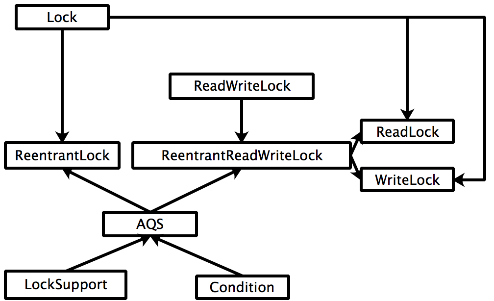
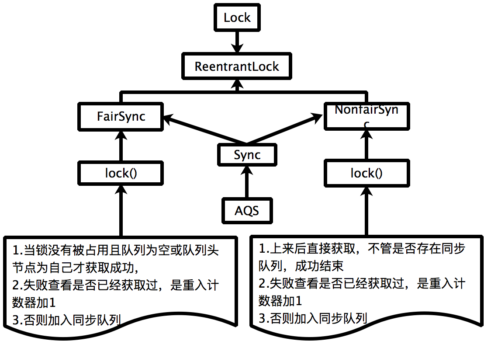
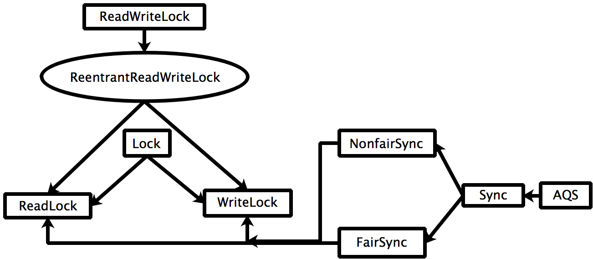

## 基础

对账场景：

1.	数据获取：三方金融机构n+1日，下载放款文件和还款文件？（线程协同）

- 顺序执行
- 原子类执行
- CountDownLatch执行（finally块countDown()执行，await()可以设置指定等待时间）
- ExecutorCompletionService

2. 对账业务处理：多线程数据获取（线程池）

- 顺序执行
- 线程池执行

3. 对账结果数据入库，入库限流？

- 获取线程池活跃执行线程数 getActiveCount()
- Semaphore

## juc（java.util.concurrent）
​	并发包主要内容：原子类，锁，容器，线程池，框架，工具类


### 1原子类

* 关于Unsafe的并发性。compareAndSwap*方法是原子的，并且可用来实现高性能的、无锁（free-lock）的数据结构。可能存在ABA问题

* 获取Unsafe实例的2种方法：反射获取字段的方法或反射获取构造函数获取

* 原子类主要提供：3类（int，long，Reference），每类3种（本身，数组，字段）的更新
    外加Boolean（底层转化为int）,具体实现对应于Unsafe类的方法

     * unsafe.compareAndSwapInt(Object o, long offset,int expected,int x)

     * unsafe.compareAndSwapLong(Object o, long offset,long expected,long x)

     * unsafe.compareAndSwapObjectObject o, long offset,Object expected,Object x)

         数组的原子更新是通过索引号 更新的具体数值的
         若想要实现其他基本类型，可以通过转化为int 或long类型转化去操作

* #### 自定义实现Integer的原子操作类

     * ```java
          public class TAtomicInteger {
          	
          	static Unsafe unsafe;
          	static long valueOffset;
          	static{
          		try {
          			/**
          			 * 方式1
          			 */
          //			Field f = Unsafe.class.getDeclaredField("theUnsafe");
          //			f.setAccessible(true);
          //			unsafe = (Unsafe) f.get(null);
          			/**
          			 * 方式2
          			 */
          			Constructor<Unsafe> unsafeConstructor = Unsafe.class.getDeclaredConstructor();
          			unsafeConstructor.setAccessible(true);
          		    unsafe = unsafeConstructor.newInstance();
          		    valueOffset = unsafe.objectFieldOffset(TAtomicInteger.class.getDeclaredField("value"));
          		} catch (Exception e) {
          			 throw new Error(e);
          		}
          	}
          	
          	private int value ;
          
          	public int getValue() {
          		return value;
          	}
          
          	public void setValue(int value) {
          		this.value = value;
          	}
          	
          	public final int getAndIncrement(int n) {
          	    return unsafe.getAndAddInt(this, valueOffset,n);
          	}
          
          	public static void main(String[] args) throws InterruptedException {
          		final TAtomicInteger cAtomicInteger = new TAtomicInteger();
          		System.out.println("init value="+cAtomicInteger.getValue());
          		final CountDownLatch countDownLatch = new CountDownLatch(1);
          		
          		for (int i = 0; i < 100; i++) {
          			new Thread(() -> {
          				try {
          					countDownLatch.await();
          					cAtomicInteger.getAndIncrement(1);
          				} catch (InterruptedException e) {
          					e.printStackTrace();
          				}
          			}).start();
          		}
          		
          		while (Thread.activeCount()!=102)
          			Thread.yield();
          		countDownLatch.countDown();
          
          		//main,Monitor Ctrl-Break
          		while (Thread.activeCount()>2)
          			Thread.yield();
          
          		System.out.println("期望100 value="+cAtomicInteger.getValue());
          	}
          }
          ```
          
          实现原理大致过程如下：

     ```java
         public final int getAndAddInt(Object var1, long var2, int var4) {
             int var5;
             do {
                 var5 = this.getIntVolatile(var1, var2);
             } while(!this.compareAndSwapInt(var1, var2, var5, var5 + var4));
     
             return var5;
         }
     ```

     - 获取当前值

     - 如果期望更新值等于当前值执行操作

     - 否则自旋，重复尝试直到成功

       

       ## 原子类的意义在哪里？

       多线程安全问题：多线程并行执行的线程同时修改一个共享值，结果可能不是预期的。

       原型类能解决多线程的核心代码在操作共享变量的并行转串行（底层jvm保证）执行，保证数据安全性

       

       

### 2锁
​	主要类关系：



#### 2.1AQS

​		常用的锁，内部是如果实现的？

- 锁是面向用户的，同步器是面向锁的（就是锁的内部实现），AQS支持互斥锁，共享锁的实现。

- 通过对state的**原子修改**来实现获取锁和释放锁；

  - 互斥锁：state在0，1质检转化实现互斥锁（TCustomSyncExclusiveLock），同一个线程继续加锁时state大于1可以实现重入锁（多次释放锁）；
  - 共享锁：多线程都加锁state大于1时可以实现共享锁（TCustomSyncShareLock），此时state的值即表示并发的线程数。

- AQS结构：

  - 实现先见先出（FIFO）的等待队列，获取不到锁会加入队列，等待唤醒。

  - AQS提供一组模板方法用于具体业务实现：互斥锁或者共享锁，独享锁(互斥锁，排它锁)，共享锁，

  - 同步队列：使用先见先出（FIFO）的等待队列，获取不到锁会加入队列，等待唤醒。

  - 阻塞队列：保存执行了await的线程节点

  - LockSupport：用于阻塞或者唤醒线程，属于工具类，不和锁关联（Condition和synchronized阻止线程必须和锁关联）

  - ConditionObject：AQS的监视器

  - 节点互相转化

    ​	同步队列和阻塞队列的节点互相转化（结合ReentrantLock说明）

    - 基本流程：首先所有节点会被加入同步队列，在执行await后会加入阻塞队列，唤醒时又会被转化回同步队列

    - 2个队列独立存在，都使用Node作为基本节点

#### 2.2ReentrantLock

​	 java语言的一个根据AQS同步器实现的锁：支持公平锁和非公平锁



- 公平锁和非公平锁的在获取锁时的不同之处（**二者都使用同步队列，非公平锁再获取时存在插队现象，这样对于队列其他的节点线程就是不公平的**）
- ReentrantLock属于互斥锁，重入锁（**释放必须和获取执行次数一样**）
- 性能问题：
  - 前提:把不同线程获取锁的一次定义为一次上下文切换
  - 获取同等锁次数情况下，非公平锁相对用时更少，原因是减少了cpu的上下文切换
  - 公平锁执行较多上下文切换次数， 而非公平锁执行上下文切换次数较少（原因是当一个线程获取释放锁后，下一次如果它再需要锁，相对比其他线程获取锁的概率更大，此时就不需要切换就相对省时）

#### 2.3ReentrantReadWriteLock



- 出现读写锁的缘由：当多读少写时，使用读写锁比使用互斥锁具有更高的并发性
- 特点：（**读锁可以并发访问，写锁时其他的读锁和其他的写锁都被阻塞**）读线程可以有多个，写线程必须一个
- 主要依据32位的int类型的state的低16位的值表示写锁（为互斥锁）；高16位的值表示读锁（为共享锁）
- 通过位运算把state值拆分为2个值：假设当前状态为s
- 写状态：s & (1 << 16) - 1   即：s&65535，也就是s与16个1（2进制的），这样就把高16位抹去了；当写状态+1时，即为s+1，只给低位加。
- 读状态：s>>>16   ,表示无符号补0右移16位；当读状态+1时，等于s+（1<<16）,结果就是只给高位加

### 3容器

  主要并发容器


#### 3.1队列

*  阻塞队列主要方法说明：
  * [add:remove]没有值或队列满时，操作报异常；属于Queue接口的规范
  * [offer:poll]返回特殊值（null或波尔值），队列满时添加失败，造成丢失元素；属于Queue接口的规范
  * [put:take]空或满时操作阻塞，但是不会丢失元素；属于BlockingQueue接口的规范
- **ArrayBlockingQueue**：数组实现的有限阻塞队列，此队列按 FIFO（先进先出）原则。
- **LinkedBlockingQueue**：一个单向链表实现的有界（可指定大小，默认Integer.MAX_VALUE）阻塞队列，此队列按 FIFO（先进先出）原则。链接队列的吞吐量通常要高于基于数组的队列，但是在大多数并发应用程序中，其可预知的性能要低。 
- **PriorityBlockingQueue**：一个无界阻塞队列，虽然此队列逻辑上是无界的，但是资源被耗尽时试图执行 add 操作也将失败，导致 OutOfMemoryError。`不支持先进先出原则` 
- **DelayQueue**：一个无界阻塞队列，内部根据PriorityQueue（无界，线程不安全队列） 存储元素，适用场景：定时执行（获取），缓存失效等
- **LinkedBlockingDeque**：链表实现的有界阻塞双端队列，支持同端存取(FILO)和异端存取（FIFO）。如果未指定容量，那么容量将等于 Integer.MAX_VALUE
- **LinkedTransferQueue**：一个链表实现的无界阻塞队列
  * tryTransfer()尝试传递给消费者 ,没有消费者放入队列
  * transfer()尝试传递给消费者 ,没有消费者自己处于阻塞状态，这种模式类似与SynchronousQueue
  * 无论是transfer还是tryTransfer方法，在>=1个消费者线程等待获取元素时（此时队列为空），都会立刻转交，这属于线程之间的元素交换。注意，这时，元素并没有进入队列。
  * 在队列中已有数据情况下，transfer将需要等待前面数据被消费掉，直到传递的元素e被消费线程取走为止。
- **SynchronousQueue**：一个不存储元素的阻塞队列
  - 其中每个插入操作必须等待另一个线程的对应移除操作，如果没被消费则一直处于阻塞
  - 此同步队列没有任何内部容量，甚至连一个队列的容量都没有,适合传递性的应用场景 

#### 3.2Copy-On-Write简称COW，仅2个类Set和List
 * Copy-On-Write简称COW，是一种用于程序设计中的优化策略，采用数组存储。
 * 使用场景：多读少写（读不加锁，写会加锁，防止多个线程多个拷贝同时造成数据混乱）
 * 写时采用复制新的容器，进行修改；新容器为原容器中对象的引用，使用完把新容器赋值给类的原有容器引用。
 * CopyOnWriteArraySet 采用CopyOnWriteArrayList 作为存储。基本差不多
 * CopyOnWrite的缺点
   * 内存占用问题。因为CopyOnWrite的写时复制机制，所以在进行写操作的时候，内存里会同时驻扎两个对象的内存，旧的对象和新写入的对象（注意:在复制的时候只是复制容器里的引用，只是在写的时候会创建新对象添加到新容器里，而旧容器的对象还在使用，所以有两份对象内存）。
   * 数据一致性问题。CopyOnWrite容器只能保证数据的最终一致性，不能保证数据的实时一致性。所以如果若希望写入的的数据，马上能读到，不建议使用CopyOnWrite容器。

#### 3.3Concurrent集合

​		均使用原子更新

 * ConcurrentHashMap（1.7 Segment 分段锁，1.8采用了 `CAS + synchronized` ） 和  HashMap 结构一样 
* ConcurrentLinkedDeque：一个无界线程安全双向链表
* ConcurrentLinkedQueue：一个无界线程安全FIFO队列
* ConcurrentSkipListMap：是TreeMap的多线的安全版本，数据结构使用跳表保存数据，实质为一种链表

### 4线程池
​	 线程池常用类关系


#### 4.1Executor`CompletionService`
 * CompletionService实现了生产者提交任务和消费者获取结果的解耦，消费者一定是按照任务完成的先后顺序来获取执行结果,注意不是提交顺序。（自定义的实现为按照提交顺序）
 * 基本实现：Executor+阻塞队列实现
 * 一组任务获取结果的场景

####4.2FutureTask
 * 仅在计算完成时才能获取结果；如果计算尚未完成，则阻塞 get 方法。
 * 可使用 FutureTask 包装 Callable 或 Runnable 对象。因为 FutureTask 实现了 Runnable，所以可将 FutureTask 提交给 Executor 执行。
    *  由于线程池(AbstractExecutorService)只执行Callable类型的任务  ,提交的 Runnable 也会转化为Callable。
    *  从类型上讲：FutureTask = Runnable+Future ;FutureTask内部又维护一个Callable，所以实际上又是一个 Callable
    *  总之：FutureTask既是Runnable 又是Callable ，还有Future的特性。
#### 4.3两种线程池
- ThreadPoolExecutor
   - ThreadPoolExecutor调节线程的原则是：先调整到最小线程，最小线程用完后，它会优先将任务 放入缓存队列(offer(task)),等缓冲队列用完了，才会向最大线程数调节。
   - 线程池线程参数设置原则
        * 无界队列：大小线程数建议设置成一致，如果使用无界队列  ，就不可能使用最大线程数
        * 有界队列：大小线程数可以不一致（当有界队列特别大时，也没有必要把core和max设置的不一样， 因为可能很难达到有界的最值，也就更难达到max的值了）
        * IO密集和CPU密集参数设置的差异
- ScheduledThreadPoolExecutor
   - ScheduledExecutorService的实现类ScheduledThreadPoolExecutor是继承线程池类ThreadPoolExecutor的，因此它拥有线程池的全部特性。但是同时又是一种特殊的线程池，这个
      线程池的线程数大小最大Integer最大值，任务队列是基于DelayQueue的无限任务队列。
      **主要提供定时执行功能，通过延时队列实现**
   - scheduleAtFixedRate【不关注上次线程执行完成】和scheduleWithFixedDelay【关注上次线程执行完成】
   - 功能效果和**Timer**类似

#### 4.4拒绝策略
* 拒绝策略4个类属于ThreadPoolExecutor的内部类
* 具体使用区别
  * AbortPolicy：当提交的不能立即执行且阻塞队列无法容纳时， 抛出异常，后续生产线程不能再正常提交到线程池
  * CallerRunsPolicy：当提交的不能立即执行且阻塞队列无法容纳时，则立即执行,后续正常提交到线程池
  * DiscardOldestPolicy：当提交的不能立即执行且阻塞队列无法容纳时，移除调队列中最早的任务,后续正常提交到线程池
  * DiscardPolicy：当提交的不能立即执行且阻塞队列无法容纳时，丢弃提交的任务,后续正常提交到线程池

### 5框架
* Executors
  * 也可以认为是创建线程池的一个低级工具类，提供创建线程池的一些静态方法
* Fork/Join
      * Fork/Join实现了“工作窃取算法”，ForkJoinTask需要通过ForkJoinPool来执行，任务分割出的子任务会添加到当前工作线程所维护的双端队列中，进入队列的头部。当一个工作线程的队列里暂时没有任务时，它会随机从其他工作线程的队列的尾部获取一个任务。
      * Fork/Join框架的设计主要2步任务
          * 第一步分割任务。首先我们需要有一个fork类来把大任务分割成子任务，有可能子任务还是很大，所以还需要不停的分割，直到分割出的子任务足够小。
          * 第二步执行任务并合并结果。分割的子任务分别放在双端队列里，然后几个启动线程分别从双端队列里获取任务执行。子任务执行完的结果都统一放在一个队列里，启动一个线程从队列里拿数据，然后合并这些数据。
      * 应用
          * 第一步：创建任务job，继承ForkJoinTask的子类:
     		 			RecursiveAction：用于没有返回结果的任务。
     		 	RecursiveTask ：用于有返回结果的任务。
          * 第二步：提交job到ForkJoinPool(获取结果如果有)

### 6工具类
* CountDownLatch : 基于AQS共享锁的实现，当state为0时唤醒等待的一个或一组线程
* CyclicBarrier : 内部维护一个count 当count为0时，等待的线程开始运行，恢复CyclicBarrier的count为原初始值parties，所以相比CountDownLatch是可以重复使用的
* Exchanger:线程互换数据
    * 每个线程既可以充当消费者，也可以充当生产者
    * 当生产大于消费时，如果一直没有被消费完，线程将处于阻塞状态
* Semaphore:
   * 基于AQS共享锁的实现
   * Semaphore可以应用于流量控制，比如对数据库的连接数控制


## lambda（java.util.function）

​	Lambda 表达式，也可称为闭包，允许函数作为参数传递进方法中。代替匿名内部类:只有一个函数的接口或只有一个未实现方法的抽象类。

  	lambda和stream结合使用使操作数据流简单

```java
e.g.1 new Thread(() -> System.out.println("使用lambda启动线程")).start();
e.g.2 自定义函数式接口
    public class TFunctionInterface {
    
    @FunctionalInterface
    public interface TestFunctionInterface<T> {
        void print(T t);
    }
    
    @Test
    public  void test1() {
        TestFunctionInterface tFunctionInterface = o -> System.out.println(o);
        tFunctionInterface.print("函数式接口");
    }
}
```

​	JDK8内置函数式接口

　　　	Function：提供任意一种类型的参数，返回另外一个任意类型返回值。 R apply(T t);

　　　	Consumer：提供任意一种类型的参数，返回空值。 void accept(T t);

​				Predicate：提供任意一种类型的参数，返回boolean返回值。boolean test(T t);

　　　	Supplier：参数为空，得到任意一种类型的返回值。T get();　　

## stream（java.util.stream）

​	Stream：流如水

```java
e.g
public static void main(String[] args) {
    String[] stringArr = {"you", "me", "she", "he"};
    Stream<String> stream1 = Arrays.stream(stringArr);
    Stream<String> stream2 = stream1.map(s -> s + "11");
    Stream<String> stream3 = stream2.limit(2);
    List<String> collect = stream3.collect(Collectors.toList());
    collect.forEach(System.out::println);
}		
```

### 分类及关系


​	4种类型的流骨架和实现

### 过程及特点


​	大致过程描述：

1. 创建head

2. 创建StatelessOp

3. 创建StatefulOp

4. 创建2个sink

5. 数据循环执行sink链

6. 流结束计算

   ### 建议：

​	比较简单的操作减少使用流操作，毕竟流底层也是for循环执行数据，构建过程本身比较复杂

# 应用

## 设计模式

## 系统设计
